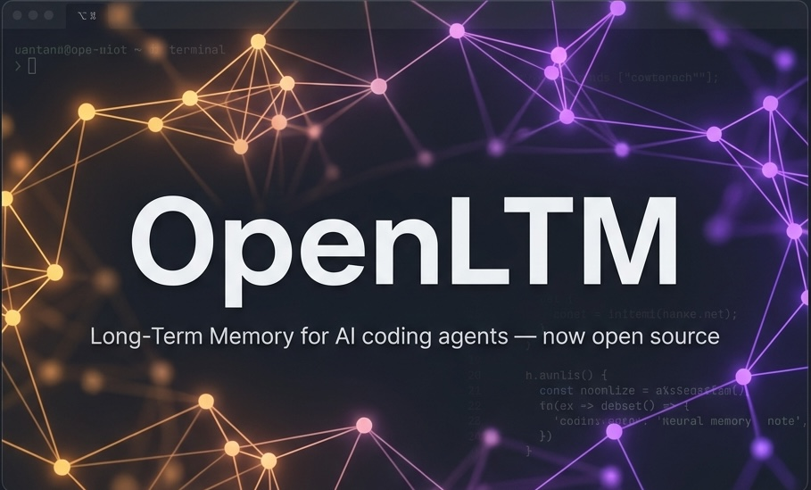

<div align="center">



# OpenLTM

### You explained your auth layer once. Why does Claude ask again tomorrow?

**Long-Term Memory for AI coding agents** — Claude Code, OpenCode, and Pi

[](CHANGELOG.md)
[](LICENSE)
[](https://bun.sh)
[](https://sqlite.org)
[](https://docs.anthropic.com/en/docs/claude-code)
[](https://modelcontextprotocol.io)

Persistent semantic memory that survives every session, every update, every compaction.

</div>

---

## 📣 Now open source

**OpenLTM was born as a private memory layer for Claude Code. Today it's fully open source under MIT.**

Same engine — automatic capture, semantic recall, importance-weighted decay, a queryable memory graph — now yours to read, fork, and extend. What started as one developer's "stop re-explaining my codebase" plugin is now an open foundation for **agent memory** across Claude Code, OpenCode, and Pi.

- 🔓 **MIT licensed** — no cloud, no account, no telemetry. Your memory lives in a local SQLite DB you own.
- 🧩 **Provider-agnostic** — one core (`@rohirik/openltm-core`), thin adapters per host.
- 🛠 **Hackable** — hooks, skills, janitor providers, and the graph visualizer are all in the open.

> Migrating from an earlier install? The marketplace is now [`RohiRIK/OpenLtm`](https://github.com/RohiRIK/OpenLtm) and the plugin is `openltm`. Your existing memory database carries over.

---

## The philosophy

Four ideas. No exceptions.

- **Memory should be automatic.** Hooks do the work. The session end hook extracts patterns, the session start hook injects them back. You shouldn't have to remember to remember.
- **Decay is a feature, not a bug.** A gotcha from six months ago that you never revisited probably no longer applies. Set `importance: 5` to make something permanent — everything else ages out naturally.
- **Semantic over keyword.** FTS5 full-text search runs first; if it returns nothing, vector embeddings kick in. You search by meaning, not exact words — *"how we handle async errors"* finds the right memory even if you never wrote those exact words.
- **Zero config, zero lock-in.** Install once, works everywhere. Every setting has a sane default. The DB lives outside the plugin directory so it survives every update. No cloud, no telemetry, no account.

---

## What you get

| | |
|---|---|
| 🔍 **Recall** | Past decisions, patterns, and gotchas — before you start work |
| 🧠 **Learn** | Every session, automatically — no manual note-taking |
| 💉 **Inject** | Top context at session start so Claude picks up where it left off |
| ⏳ **Decay** | Stale memories fade while critical knowledge lives forever |
| 🕸 **Graph** | Traverse relationships between memories for reasoning chains |
| 🗺 **Visualize** | See your entire memory network in a browser-based explorer |
| ⚡ **Vec Recall** | Semantic vector (KNN) recall via sqlite-vec; degrades to JS-cosine when unavailable |
| 🔌 **Extensions** | sqlite-vec + Honker (queue/cron/pub-sub) loaded dynamically; graceful fallback without system libsqlite3 |

---

## Install

### Marketplace (recommended)

```bash
claude plugin marketplace add https://github.com/RohiRIK/OpenLtm
claude plugin install openltm
```

Restart Claude Code. That's it. Four Claude Code hooks + one git post-commit hook auto-wire, four commands load, five skills activate, and your `openltm.db` migrates or creates itself.

### bunx (no clone)

```bash
bunx @rohirik/openltm-core          # auto-detect Claude Code, OpenCode
bunx @rohirik/openltm-core --pi     # experimental Pi adapter
bunx @rohirik/openltm-core --dry-run --claude  # preview without writing
```

### Dev / git clone

```bash
git clone https://github.com/RohiRIK/OpenLtm ~/Projects/OpenLtm
cd ~/Projects/OpenLtm && bash install.sh
```

---

## Quick Start

Start a new session. Context is injected at the top automatically.

Then try:

```
/openltm:memory recall auth       — what do we know about auth in this project?
/openltm:memory learn <insight>   — save something worth keeping
/openltm:health                   — memory health + decay summary
/openltm:project init             — set a goal for the current project
```

That's it. The rest is hooks doing the work.

---

## The shape of memory

```
Claude Code
   │
   ├── 4 Commands  ──┐
   ├── 5 Skills    ──┼──▶  openltm MCP server ──▶  openltm.db
   └── 5 Hooks     ──┘                        (memories, tags,
                                                context_items,
                                                memory_relations,
                                                memories_fts)
```

Full deep-dive — schema, hook architecture, decay formula, ADRs — in [How It Works](docs/02-how-it-works.md) and [Architecture](docs/03-architecture.md).

> **SQLite Extensions:** The plugin loads sqlite-vec (vec0 / KNN vector search) and Honker (async embedding queue, leader-elected cron, pub-sub) when a system extension-enabled libsqlite3 is available. Both degrade gracefully — missing binary or library leaves the capability off and falls back to JS-cosine, file-watch polling, or in-process cron. Controlled with `LTM_DISABLE_VEC`, `LTM_DISABLE_HONKER`, `LTM_SQLITE_LIB`, and `LTM_HONKER_EXT` env vars.

---

## Verify

```bash
/openltm:health                    # plugin health + hooks + decay
/openltm:memory recall test        # returns results (or "no results" on fresh install)
```

Start a new session — you should see context injected at the top. If not, run `/openltm:health` to diagnose.

---

## Go deeper

Full documentation index: [`docs/`](docs/README.md).

| I want to… | Read |
|---|---|
| Get running in five minutes | [Quickstart](docs/00-quickstart.md) |
| See every install option | [Installation](docs/01-installation.md) |
| Use every command and its flags | [Commands](docs/05-commands.md) |
| Tune decay, injection, embedding behavior | [Configuration](docs/04-configuration.md) |
| See how it works under the hood | [How It Works](docs/02-how-it-works.md) · [Architecture](docs/03-architecture.md) |
| Understand the schema and data model | [DB Spec](docs/internal/DB-SPEC.md) |
| See all hooks, skills, and MCP tools | [Hooks](docs/06-hooks.md) · [Skills](docs/07-skills.md) · [MCP Tools](docs/08-mcp-tools.md) |
| Fix a problem | [Troubleshooting](docs/09-troubleshooting.md) |
| See the product vision and where it's going | [PRD](docs/internal/PRD.md) · [Roadmap](docs/internal/ROADMAP.md) |
| Contribute a change | [Contributing](CONTRIBUTING.md) |
| Check what changed | [Changelog](CHANGELOG.md) |

---

## Contributing

Open an issue first to discuss the change, then send a PR. The full workflow — setup, tests, the version-bump rule, and release steps — is in [CONTRIBUTING.md](CONTRIBUTING.md).

[Report a Bug](https://github.com/RohiRIK/OpenLtm/issues)

---

## License

MIT — [RohiRIK](https://github.com/RohiRIK)

---

<div align="center">

**Built for [Claude Code](https://docs.anthropic.com/en/docs/claude-code)**

*Powered by caffeine, SQLite, and the persistent belief that context shouldn't die at the end of a session.*

</div>
