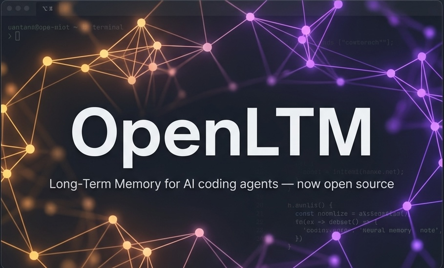

<div align="center">



# OpenLTM

### You explained your auth layer once. Why does Claude ask again tomorrow?

**Long-Term Memory for AI coding agents** — Claude Code, OpenCode, Pi, OpenClaw, and Hermes

[](CHANGELOG.md)
[](LICENSE)
[](https://bun.sh)
[](https://sqlite.org)
[](https://docs.anthropic.com/en/docs/claude-code)
[](https://modelcontextprotocol.io)

Persistent semantic memory that survives every session, every update, every compaction.

</div>

---

## Now open source

**OpenLTM began as a private memory layer for one agent. It is now MIT licensed, and the whole engine is on your disk to read, fork, and break.**

- **One engine, five hosts.** `@rohirik/openltm-core` holds the memory logic; each host gets a thin adapter (Hermes gets a native Python plugin over the same database).
- **You own the file.** A local SQLite database. No account, no dashboard, no vendor copy.
- **Everything is hackable.** Hooks, skills, janitor providers, the graph visualizer. All of it in the open.

> Migrating from an earlier install? The marketplace is now [`RohiRIK/OpenLtm`](https://github.com/RohiRIK/OpenLtm) and the plugin is `openltm`. Your existing memory database carries over.

---

## Read this before you store anything

**The database is local. Embeddings are local by default. The janitor LLM is not.**

Semantic search needs vectors. The default embedding provider is a local [llama.cpp](https://github.com/ggerganov/llama.cpp) server (`llama-server --embeddings`), model `bge-m3`, via the OpenAI-compatible `POST /v1/embeddings` endpoint. If that server is not running, recall stays on FTS5 — memory text is not sent anywhere. Gemini, OpenAI, and Cohere are opt-in (`LTM_EMBED_PROVIDER=gemini` plus an API key).

The janitor's LLM providers — Anthropic, Cohere, Gemini — still receive memory content when a summary or relation call is configured. That default is unchanged.

There is no telemetry and no analytics in any configuration.

```bash
# embeddings (default). Install llama.cpp, then:
llama-server -m bge-m3.gguf --embeddings --pooling mean --port 8080

# optional overrides
export LTM_LLAMA_CPP_URL=http://127.0.0.1:8080
export LTM_EMBED_MODEL=bge-m3
export LTM_EMBED_PROVIDER=gemini      # opt out of local embeddings
export LTM_LLM_PROVIDER=ollama        # janitor summaries stay local
```

Full detail, including which write paths scrub secrets and which don't: [Security notes](#security-notes).

---

## The philosophy

**Memory should be automatic.** Hooks do the work. The session-end hook extracts patterns, the session-start hook injects them back. You shouldn't have to remember to remember.

**Decay is a feature, not a bug.** A gotcha from six months ago that you never revisited probably no longer applies. Set `importance: 5` and a memory never ages out. Everything else fades at a rate set by how confident you were and how often it proved true (`janitor/decay.ts`).

**Semantic over keyword.** FTS5 full-text search runs first. If it returns nothing, vector embeddings kick in. You search by meaning — *"how we handle async errors"* finds the memory even if you never wrote those words.

**Own your data.** A file on your disk. When you leave the project, so does everything you taught it.

---

## What you get

| Capability | What it actually does | Where it lives |
|---|---|---|
| Recall | FTS5 first, vector KNN as fallback — search by meaning, not exact words | `openltm-core/src/recall/` · `src/vec/index.ts` |
| Learn | Stores a memory with category, importance, and confidence; scrubs secrets on this path | `openltm-core/src/db.ts:561` |
| Inject | Renders the top-ranked memories as context at session start | `openltm-core/src/context.ts:49` |
| Decay | Ages memories by importance × confidence; `importance: 5` is permanent | `openltm-core/src/janitor/decay.ts` |
| Graph | Traverses relations between memories and builds a reasoning chain | `openltm-core/src/graph.ts:69` |
| Visualize | A browser explorer over the live database, with janitor controls | `src/graph-server.ts` · `graph-app/` |
| Extensions | sqlite-vec and Honker loaded from disk, with a working fallback when absent | `openltm-core/src/extensions.ts:160` |
| Deduplicate | Merges memories the janitor judges to be the same thing | `openltm-core/src/janitor/dedup.ts` |

---

## Five hosts, one database

The engine is one package. Each host gets an adapter, and all of them open the same `openltm.db` — so a gotcha learned in Claude Code is already there when you open OpenCode.

| Host | Adapter | Install |
|---|---|---|
| Claude Code | `.claude-plugin/` | `claude plugin install openltm` |
| OpenCode | `@rohirik/opencode-ltm` | `bunx @rohirik/openltm-core --opencode` |
| Pi | `@rohirik/pi-ltm` | `bunx @rohirik/openltm-core --pi` |
| OpenClaw | `@rohirik/openclaw-ltm` | `openclaw plugins install clawhub:@rohirik/openclaw-ltm` |
| Hermes | `hermes/openltm_hermes` (Python) | `hermes plugins install openltm` |

Hermes gets a native Python plugin rather than an adapter: a separate implementation over the same database and the same schema.

---

## Where to get it

| Channel | What ships there | Link | Updates |
|---|---|---|---|
| Claude Code marketplace | the `openltm` plugin | [`RohiRIK/OpenLtm`](https://github.com/RohiRIK/OpenLtm) (the repo is the marketplace) | automatic on every tag |
| npm | `@rohirik/openltm-core` | [npmjs.com/package/@rohirik/openltm-core](https://www.npmjs.com/package/@rohirik/openltm-core) | automatic on every tag |
| npm | `@rohirik/opencode-ltm` | [npmjs.com/package/@rohirik/opencode-ltm](https://www.npmjs.com/package/@rohirik/opencode-ltm) | automatic on every tag |
| npm | `@rohirik/pi-ltm` | [npmjs.com/package/@rohirik/pi-ltm](https://www.npmjs.com/package/@rohirik/pi-ltm) | automatic on every tag |
| npm | `@rohirik/openclaw-ltm` | [npmjs.com/package/@rohirik/openclaw-ltm](https://www.npmjs.com/package/@rohirik/openclaw-ltm) | automatic on every tag |
| ClawHub (OpenClaw) | `@rohirik/openclaw-ltm` | `openclaw plugins install clawhub:@rohirik/openclaw-ltm` | on every tag once the `clawhub` job is in `publish.yml` ([status](docs/11-publishing.md#publishing-to-clawhub--automated-on-every-tag-once-the-job-is-added)); until then by hand |
| Hermes Plugin Catalog | `openltm` | [`plugin-catalog/openltm.yaml`](https://github.com/NousResearch/hermes-agent/blob/main/plugin-catalog/openltm.yaml) · [catalog page](https://hermes-agent.nousresearch.com/docs/plugins/openltm) | pinned to a commit; each update is a reviewed PR to NousResearch |

How each channel is published, and what to do when one breaks: [`docs/11-publishing.md`](docs/11-publishing.md).

---

## Install

### Marketplace (recommended for Claude Code)

```bash
claude plugin marketplace add https://github.com/RohiRIK/OpenLtm
claude plugin install openltm
```

Restart Claude Code. Five hooks auto-wire, six commands load, seven skills activate, and your `openltm.db` migrates or creates itself.

### bunx (no clone)

```bash
bunx @rohirik/openltm-core                        # auto-detect installed hosts
bunx @rohirik/openltm-core --pi                   # experimental Pi adapter
bunx @rohirik/openltm-core --dry-run --claude     # show me everything you'd write, write nothing
```

### Hermes

```bash
hermes plugins install openltm
hermes config set memory.provider openltm
hermes gateway restart          # plugins load only at startup
```

Installs the reviewed commit pinned in the [Hermes Plugin Catalog](https://hermes-agent.nousresearch.com/docs/plugins/openltm). Details: [`docs/10-hermes-plugin.md`](docs/10-hermes-plugin.md).

### OpenClaw

```bash
openclaw plugins install clawhub:@rohirik/openclaw-ltm --accept-capabilities   # from ClawHub
openclaw plugins install @rohirik/openclaw-ltm --force --accept-capabilities   # or straight from npm
```

Requires OpenClaw `>= 2026.9.6`, Node 24 (the host's own requirement), and Bun on `PATH`. `--accept-capabilities` consents to the plugin registering its memory tools; `--force` is how OpenClaw makes you acknowledge that an npm install is outside ClawHub review (verified on OpenClaw 2026.9.8). Details: [`packages/adapter-openclaw/README.md`](packages/adapter-openclaw/README.md).

### Dev / git clone

```bash
git clone https://github.com/RohiRIK/OpenLtm ~/Projects/OpenLtm
cd ~/Projects/OpenLtm && bash install.sh
```

**What that installer does outside this repo.** It writes `~/.claude.json`, creates `~/.claude/settings.json` if it isn't there, and adds `mcp__plugin_openltm_memory` to the `permissions.allow` list so the memory tools stop prompting for approval. That's a deliberate widening of your agent's tool permissions, and it's the kind of thing an installer should tell you about. Read [`scripts/install-wiring.ts`](scripts/install-wiring.ts) first if you'd rather look before running.

---

## Quick start

Start a new session. Context is injected at the top automatically.

```
/openltm:memory recall auth       — what do we know about auth in this project?
/openltm:memory learn <insight>   — save something worth keeping
/openltm:health                   — memory health + decay summary
/openltm:project init             — set a goal for the current project
```

### For headless agents

Slash commands and the `ltm_*` tools only exist inside an agent TUI. From a plain shell — scripts, cron, CI:

```bash
bunx @rohirik/openltm-core memory learn --text "Docker Hub rate limits unauthenticated pulls" \
  --category gotcha --importance 4 --project homelab --json
bunx @rohirik/openltm-core memory recall --query "docker rate limit" --json
bunx @rohirik/openltm-core memory forget --id 42 --reason "outdated"
bunx @rohirik/openltm-core memory context --project homelab
```

Any MCP-capable host can run the full server directly:

```bash
bunx @rohirik/openltm-core mcp-serve
```

---

## Security notes

Three things worth knowing before this holds anything you care about.

**Secret scrubbing is not applied on every write path.** `learn()` scrubs before storing (`packages/openltm-core/src/db.ts:561`). The janitor's promote and dedup paths, and context capture, write to `memories` and `context_items` without it. The scrubber also fails open — on an internal error it returns the original text unchanged (`secretsScrubber.ts:101`) — and it is a pattern denylist, not a guarantee. Stored memory is not the same as redacted memory.

**`LTM_SQLITE_LIB` and `LTM_HONKER_EXT` load native code.** Both are filesystem paths handed to a SQLite extension loader (`extensions.ts:132,144`). There is no allowlist and no signature check. Set them only to paths you trust, or turn the loaders off with `LTM_DISABLE_VEC=1` and `LTM_DISABLE_HONKER=1`.

**npm publishing is tokenless.** Releases authenticate through GitHub OIDC trusted publishing with provenance. No `NPM_TOKEN` is stored in this repository.

---

## Go deeper

| I want to… | Read |
|---|---|
| Get running in five minutes | [Quickstart](docs/00-quickstart.md) |
| See every install option | [Installation](docs/01-installation.md) |
| Use every command and its flags | [Commands](docs/05-commands.md) |
| Tune decay, injection, embedding behavior | [Configuration](docs/04-configuration.md) |
| See how it works under the hood | [How It Works](docs/02-how-it-works.md) · [Architecture](docs/03-architecture.md) |
| Understand the schema and data model | [DB Spec](docs/internal/DB-SPEC.md) |
| See all hooks, skills, and MCP tools | [Hooks](docs/06-hooks.md) · [Skills](docs/07-skills.md) · [MCP Tools](docs/08-mcp-tools.md) |
| Publish a release | [Publishing](docs/11-publishing.md) |
| Fix a problem | [Troubleshooting](docs/09-troubleshooting.md) |
| See where it's going | [PRD](docs/internal/PRD.md) · [Roadmap](docs/internal/ROADMAP.md) |
| Contribute a change | [Contributing](CONTRIBUTING.md) |
| Check what changed | [Changelog](CHANGELOG.md) |

---

## Environment variables

| Variable | Purpose |
|---|---|
| `LTM_DB_PATH` | Where the SQLite file lives. Overrides the default location. |
| `LTM_EMBED_PROVIDER` | Embedding provider. Unset probes local llama.cpp (`llamacpp`); falls back to FTS if the server is down. `gemini` / `openai` / `ollama` / `disabled` opt in or out. |
| `LTM_LLM_PROVIDER` | Provider for janitor summaries. |
| `LTM_DISABLE_VEC` | Turn off the sqlite-vec loader; falls back to JS-cosine. |
| `LTM_DISABLE_HONKER` | Turn off the Honker loader. |
| `LTM_SQLITE_LIB` | Explicit path to a SQLite library. Loads native code. |
| `LTM_HONKER_EXT` | Explicit path to the Honker extension. Loads native code. |
| `LTM_CHANNEL` | Honker pub-sub channel. |
| `LTM_BACKUP_RETENTION` | How many rotated backups to keep. |

---

## License

MIT — [RohiRIK](https://github.com/RohiRIK)

---

<div align="center">

*Built for agents that forget, and shouldn't.*

</div>
