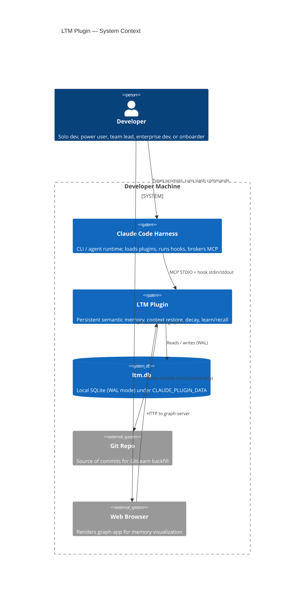
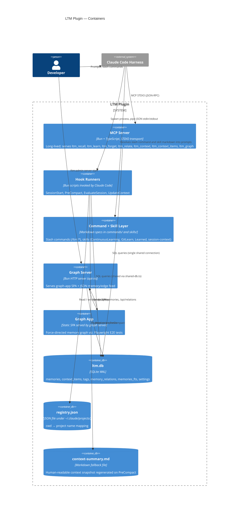
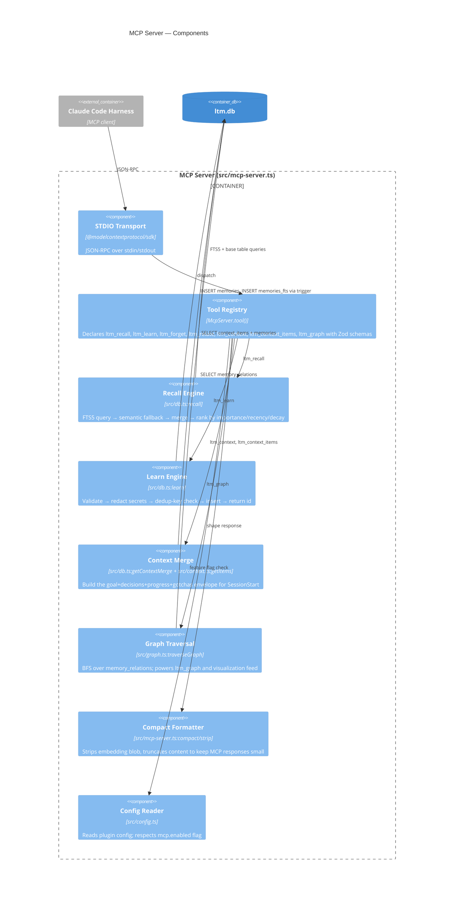
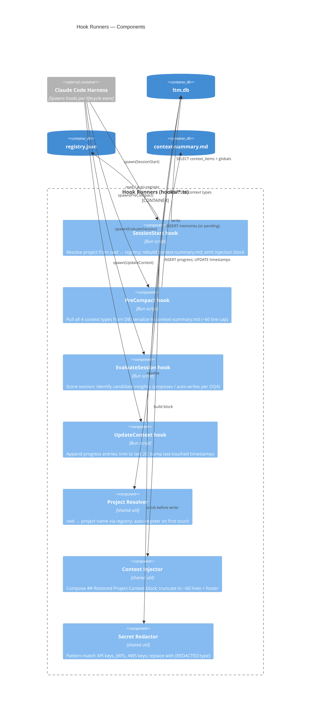
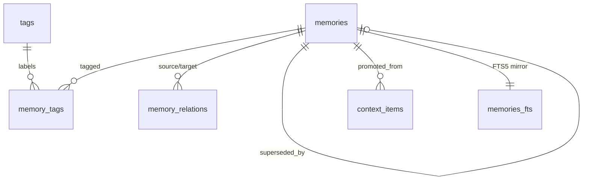
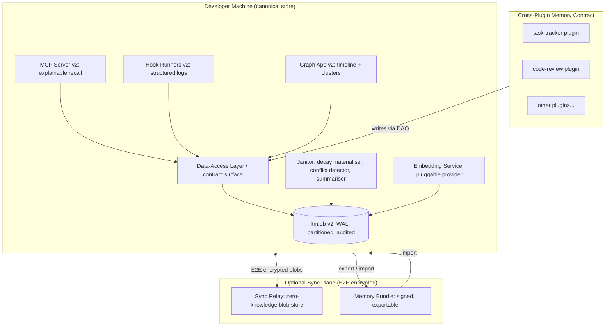
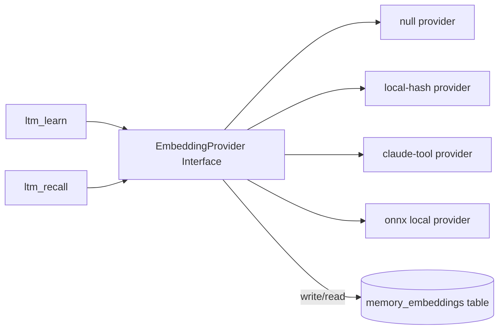
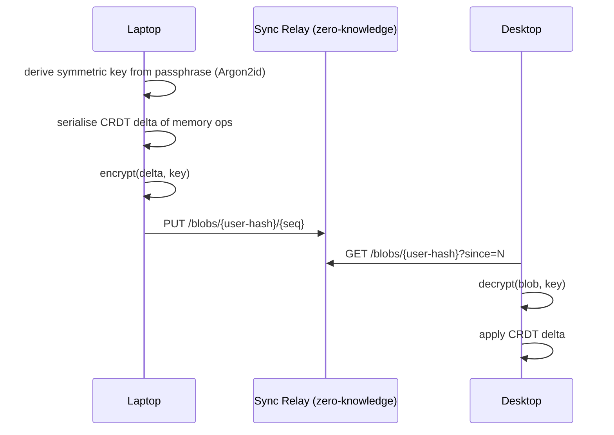
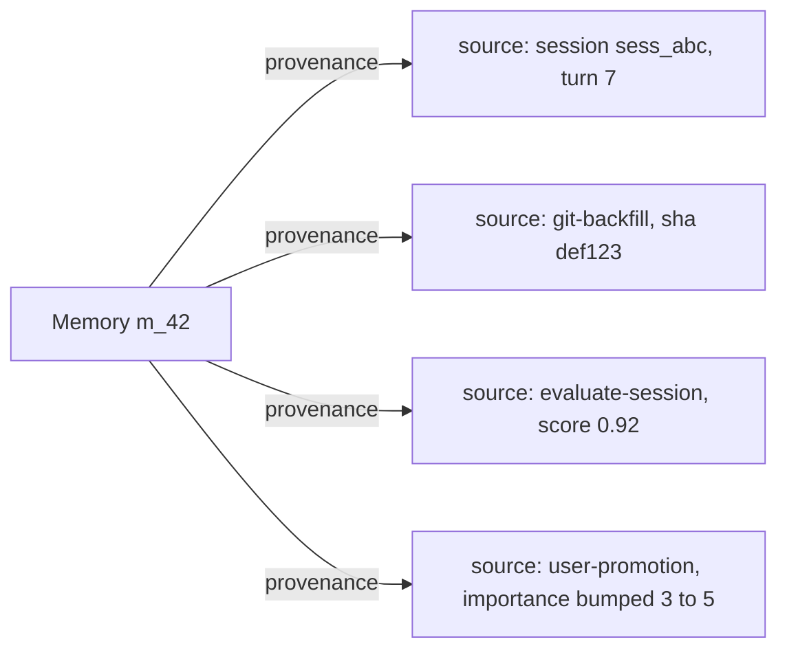
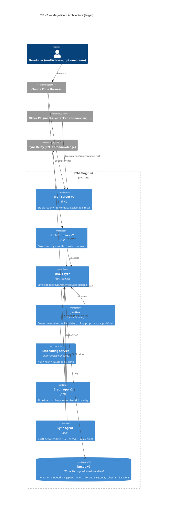

# ARCHITECTURE — Claude LTM Plugin

**Version:** 1.0 (against plugin v1.4.20)
**Owner:** system-architect (dev-team)
**Status:** Baseline architecture spec; companion to `docs/PRD.md`
**Last updated:** 2026-04-28

This document describes the as-built architecture of the Claude LTM plugin, an honest
assessment of its weaknesses, and a target "magnificent" architecture with a phased
migration path. It is the reference artifact for the `database-admin` agent (schema work),
the `backend-developer` agent (server / hook work), and the `cloud-architect` agent (any
future sync surfaces).

The PRD (`docs/PRD.md`) is the contract: §4 (feature inventory) is the as-built ground
truth; §5 (user stories) the acceptance contract; §6 (gaps) the opportunity space this
spec turns into a roadmap.

---

## Table of Contents

1. System Context (C4 L1)
2. Container Diagram (C4 L2)
3. Component Diagram (C4 L3)
4. Data Flow: Full Session Lifecycle
5. Data Model Overview
6. Architectural Decision Records
7. Current Architectural Weaknesses
8. Magnificent Future Architecture
9. Migration Path
10. Non-Goals

---

## 1. System Context (C4 Level 1)

The LTM plugin is a sidecar process to the Claude Code harness. Everything it does is
local to the developer's machine. There is no cloud dependency, no telemetry, no
multi-tenant store. Two external integration surfaces exist: the MCP protocol (how
Claude talks to the plugin) and Git (read-only, used by the GitLearn skill for backfill).



**Boundaries**

- **Inside the boundary:** plugin code, the SQLite DB, the registry JSON, and the
  cache directory the plugin loader reads from. All on the developer's filesystem.
- **Outside:** the Claude Code harness itself (a black box that fires lifecycle events
  and routes MCP calls). The browser, used only for the optional graph UI.
- **Explicitly excluded:** any third-party API. The plugin makes **zero outbound
  network calls** by default. Any future cloud sync (G-I) is opt-in and end-to-end
  encrypted.

---

## 2. Container Diagram (C4 Level 2)

The plugin decomposes into five runtime containers plus shared on-disk state. The MCP
server is the tool surface; hooks are short-lived processes triggered by lifecycle
events; the graph server is opt-in.



**Notes on shared state**

- A single SQLite connection is held by `shared-db.ts` and reused across MCP server,
  hooks, and graph server within one process. WAL mode permits concurrent readers
  with a single writer; cross-process safety relies on SQLite's file locking.
- `registry.json` is a small JSON map. Concurrent writes are rare (only during
  `/ltm:project register` or `SessionStart` first-touch) but unsynchronised — a
  known weakness called out in §7.
- `context-summary.md` is a write-mostly artifact regenerated by `PreCompact`. It is
  never the source of truth; the DB is.

---

## 3. Component Diagram (C4 Level 3)

This level breaks the **MCP server** and **hook runners** into their internal
components. The command/skill layer is intentionally not decomposed — markdown specs
have no internal components.

### 3.1 MCP Server components



### 3.2 Hook Runners components



**Component responsibilities at a glance**

| Component | Responsibility | Single source of truth for |
|-----------|----------------|---------------------------|
| Recall Engine | Search ranking | Merging FTS5 + semantic results, applying decay |
| Learn Engine | Write path | Dedup, redaction, importance/category enforcement |
| Context Merge | Read path for SessionStart | Envelope shape (goal + decisions + progress + gotchas) |
| Project Resolver | cwd → project | Authoritative map; auto-registration |
| Secret Redactor | Pattern scrub | Redaction policy, called from learn + EvaluateSession |
| Context Injector | Format injection | 60-line budget, footer rendering |
| Compact Formatter | MCP response shaping | Stripping embedding blob, content truncation |

---

## 4. Data Flow: Full Session Lifecycle

This is the canonical end-to-end flow that ties every container and component together.
A "session" spans from Claude Code launch in a project cwd through to clean exit (or
compaction-triggered restart). The diagram shows one full cycle.

```mermaid
sequenceDiagram
  autonumber
  actor Dev as Developer
  participant Claude as Claude Code Harness
  participant Start as SessionStart hook
  participant Reg as registry.json
  participant DB as ltm.db (SQLite)
  participant MCP as MCP Server
  participant Eval as EvaluateSession hook
  participant Pre as PreCompact hook
  participant Update as UpdateContext hook
  participant Sum as context-summary.md

  Note over Dev,Sum: --- Session start ---
  Dev->>Claude: cd into project, launch Claude Code
  Claude->>Start: spawn(SessionStart, stdin=cwd)
  Start->>Reg: resolve(cwd) → project_name (auto-register if new)
  Start->>DB: SELECT goal, decisions, gotchas, progress (project) + importance-5 globals
  Start-->>Claude: stdout = "## Restored Project Context\n..." (≤ 60 lines)
  Claude-->>Dev: render injected block

  Note over Dev,Sum: --- Recall before deciding ---
  Dev->>Claude: prompt that requires past context
  Claude->>MCP: ltm_recall({ query, project })
  MCP->>DB: FTS5(MATCH) → ranked rowids
  alt FTS5 returns < 3 results
    MCP->>DB: semantic fallback (embedding similarity)
    MCP->>MCP: merge + dedup by id
  end
  MCP->>MCP: apply decay scoring + importance boost
  MCP-->>Claude: top-N memories (compact, embedding-stripped)
  Claude-->>Dev: answer informed by recalled context

  Note over Dev,Sum: --- Work + learn ---
  Dev->>Claude: makes a decision; runs /ltm:memory learn
  Claude->>MCP: ltm_learn({ content, category, importance, project })
  MCP->>MCP: redact secrets; compute dedup_key
  MCP->>DB: INSERT memories (trigger writes memories_fts)
  MCP-->>Claude: { id }

  Note over Dev,Sum: --- Mid-session: compaction ---
  Claude->>Pre: spawn(PreCompact)
  Pre->>DB: SELECT all 4 context types for project
  Pre->>Sum: write context-summary.md (~60 lines, fallback)
  Pre-->>Claude: ack
  Claude->>Claude: compact transcript
  Note over Claude: Next assistant turn re-reads context-summary.md if needed

  Note over Dev,Sum: --- Session end ---
  Claude->>Update: spawn(UpdateContext)
  Update->>DB: INSERT progress; trim oldest > 20; UPDATE last_touched
  Update-->>Claude: ack
  Claude->>Eval: spawn(EvaluateSession)
  Eval->>DB: scan transcript-derived signals; propose / write candidate insights
  Eval-->>Claude: ack
  Claude-->>Dev: clean exit
```

**Per-step contracts**

| Step | Read from | Writes to | Failure mode |
|------|-----------|-----------|--------------|
| SessionStart | DB, registry | registry (auto-register only) | Hook silent-fail → no injection; `/ltm:doctor` detects |
| ltm_recall | DB (FTS5 + base) | DB (last_recalled_at, recall_count) | Returns empty array; never throws into Claude |
| ltm_learn | — | DB (memories, memories_fts via trigger) | Reject duplicate dedup_key; redact before write |
| PreCompact | DB | context-summary.md | If write fails, post-compact session loses fallback only |
| EvaluateSession | transcript signals, DB | DB (memories) | OQ4 — propose vs. auto-write is open |
| UpdateContext | — | DB (context_items progress) | Trim ensures bounded growth |

---

## 5. Data Model Overview

The persistent store is one SQLite file (`ltm.db`) under `${CLAUDE_PLUGIN_DATA}`.
Schema lives in `src/schema.sql` and is extended idempotently by migrations in
`src/shared-db.ts`. WAL mode is enabled for read-during-write concurrency.

### 5.1 Tables

| Table | Purpose | Lifecycle |
|-------|---------|-----------|
| `memories` | Long-term, durable insights (decisions, gotchas, patterns, etc.). Global or project-scoped. | Permanent unless soft-deleted via `status` |
| `context_items` | Short-term, per-project context. The 4 PRD-defined types: goal, decision, progress, gotcha. | Mixed: progress trimmed to last 20; goal replaced; decision/gotcha permanent |
| `tags` | Tag dictionary (unique names). | Auto-created on use |
| `memory_tags` | M:N join — memory ↔ tag. | Cascading on memory delete |
| `memory_relations` | Knowledge graph edges between memories with typed relationship. | Cascading on memory delete |
| `memories_fts` | FTS5 virtual table mirroring `memories.content`. | Maintained by triggers (insert/update/delete) |
| `settings` | Key-value config for janitor / provider settings. | Manual or migration-managed |

### 5.2 `memories` — key columns

| Column | Purpose |
|--------|---------|
| `id` | Primary key, surrogate `INTEGER` |
| `content` | The memory text. Subject to redaction on write. |
| `category` | One of: `preference`, `architecture`, `gotcha`, `pattern`, `workflow`, `constraint` |
| `importance` | 1–5; `5` opts a global memory into every-session injection |
| `confidence` | 0.0–1.0; reserved for janitor / promotion logic |
| `project_scope` | NULL = global; else project_name (joined with registry) |
| `dedup_key` | UNIQUE; prevents repeated learns of the same fact |
| `status` | `active` / `pending` / `deprecated` / `superseded` — soft-delete + supersession |
| `embedding` | Float32 BLOB; semantic fallback vector. Stripped from MCP responses (would balloon to ~260 KB). |
| `last_used_at`, `last_recalled_at`, `recall_count` | Decay inputs |
| `superseded_by`, `superseded_at` | Pointer to the memory that replaced this one (audit trail) |
| `workspace_id`, `agent_id` | T16 multi-agent metadata; indexed |

### 5.3 `context_items` — key columns

| Column | Purpose |
|--------|---------|
| `project_name` | Foreign-keyed by name to the registry |
| `type` | `goal` / `decision` / `progress` / `gotcha` |
| `content` | Free text |
| `permanent` | 1 for decision/gotcha; 0 for goal/progress |
| `memory_id` | Optional link back to a promoted global memory |
| `status` | `active` / `pending_promotion` / `promoted` |

### 5.4 FTS5 setup

- `memories_fts` is a `content='memories'` external-content FTS5 virtual table.
  Triggers (`memories_ai`, `memories_au`, `memories_ad`) keep the index in sync on
  insert/update/delete.
- Recall path: parameterised `MATCH` query against `memories_fts`, joined back to
  `memories` for category/project/importance filters and decay scoring.
- BM25 ranking is the default; the recall engine post-multiplies by importance and
  decay factors before returning top-N.

### 5.5 Decay model (current)

The current implementation applies decay at recall time, not as a stored score.

- **Inputs:** `last_recalled_at`, `recall_count`, `importance`, `created_at`.
- **Rule sketch:**
  - If `importance == 5`, no decay.
  - If memory has not been recalled in 90+ days and `importance < 3`, multiply rank
    by a decay factor (< 1).
  - Recently-recalled memories get a freshness boost.
- **Reporting:** `/ltm:health` summarises memories by decay bucket
  (`fresh` / `aging` / `stale`) and surfaces top-5 staleness candidates.
- **OQ3** (PRD §9): the exact function (linear / exponential / recall-driven) is open
  and intended to be tuned with real recall logs.

### 5.6 Relationships



### 5.7 Registry (out-of-DB)

`~/.claude/projects/registry.json` holds the cwd → project_name map. It is a JSON
file (not a table) for cross-plugin readability and trivial inspection. Concurrent
write safety is **not** guaranteed — a known weakness (§7).

---

## 6. Architectural Decision Records

Each ADR is short and load-bearing. Format: Status, Context, Decision, Alternatives,
Consequences. Every ADR includes at least one rejected alternative.

---

### ADR-001 — SQLite as the storage engine

**Status:** Accepted. In production since v1.0.

**Context.** The plugin needs durable, queryable, low-latency storage on the
developer's machine. It must survive Claude Code restarts, plugin upgrades, and
machine sleep. Median write latency target: < 50 ms p95 (PRD §8.4 R3). Median recall
< 200 ms (G2). Zero cloud dependency by default (PRD §7 N1).

**Decision.** Use SQLite (via `bun:sqlite`) in WAL mode, single file at
`${CLAUDE_PLUGIN_DATA}/ltm.db`. FTS5 virtual table for full-text search.

**Alternatives considered.**

- **Postgres / managed DB.** Rejected. Adds an installation dependency, defeats the
  zero-cloud promise, and is overkill for single-user data volumes (~10⁴–10⁶ rows
  realistic ceiling).
- **Flat JSON / Markdown files (the pre-1.0 design).** Rejected. No transactional
  semantics, no FTS, no concurrent reader safety, O(N) scan per recall. The current
  `context-summary.md` is the vestigial fallback; it is a *projection*, not the truth.
- **DuckDB.** Considered. Better analytical perf, but heavier binary, weaker FTS
  story, less Bun-native tooling, and write-heavy workloads (learn + decay updates)
  favour SQLite.
- **LevelDB / RocksDB key-value.** Rejected. No SQL, no FTS5, would need a hand-rolled
  index for every query path.

**Consequences.**

- (+) One-file backup story; `cp ltm.db ltm.db.bak` is a complete export.
- (+) FTS5 ships in SQLite — no extra dependency for full-text search.
- (+) `bun:sqlite` is in-process; no IPC overhead per query.
- (–) Single-writer constraint (mitigated by WAL); cross-process locking is the
  developer's responsibility to understand.
- (–) Schema migrations must be hand-coded and idempotent (see `src/shared-db.ts`).
  ADR-004 and §7 weakness W3 expand on this.
- (–) Embedding column as BLOB grows the row size fast; the formatter strips it
  before MCP transmission to avoid 260 KB-per-memory responses.

---

### ADR-002 — Hook-based lifecycle integration

**Status:** Accepted.

**Context.** Claude Code is a black-box harness. The plugin needs to (a) inject
context at session start, (b) survive compaction without state loss, (c) record
progress at session end, and (d) propose learnings post-session. MCP tools cover the
"on demand" surface but not "automatic on lifecycle event".

**Decision.** Use Claude Code's hook surface for four lifecycle events:
`SessionStart`, `PreCompact`, `EvaluateSession`, `UpdateContext`. Hooks are
short-lived Bun scripts in `hooks/`. They share the DB connection logic with the MCP
server via `src/shared-db.ts`.

**Alternatives considered.**

- **MCP-only.** Rejected. There is no MCP equivalent to "this is a fresh session,
  inject context now". Without hooks, the developer would have to manually call
  `ltm_context` at every session start — defeats J1 and US-1.
- **Background daemon.** Rejected. Long-lived process management on developer
  machines is fragile (sleep/wake, terminal close). Also conflates "react to event"
  with "serve queries".
- **Polling cron.** Rejected. Not aligned with session boundaries; can't inject at
  start.

**Consequences.**

- (+) Hook semantics align directly with PRD user stories US-1, US-4, US-13, US-17.
- (+) Each hook is independently testable and replaceable.
- (–) Hook failures are silent by default — drove the need for `/ltm:doctor` (US-9).
- (–) Coupling to Claude Code's hook contract; if the harness changes the contract,
  hooks break. Mitigated by the `update-wiring.ts` postinstall script that keeps
  `settings.json` in sync.
- (–) Four hook processes per session add some startup latency; offset by Bun's
  fast cold start (~30 ms typical).

---

### ADR-003 — FTS5 for recall (with semantic fallback)

**Status:** Accepted, with semantic fallback as a deliberate hedge.

**Context.** Recall is the primary read path (PRD G2). It must return relevant
memories on natural-language queries in under 200 ms median. The data set is
single-developer-scale (10²–10⁵ memories realistically). There is no model server.

**Decision.** Primary search is SQLite FTS5 BM25 over `memories.content`. If FTS5
returns < 3 results for a query, fall back to a semantic similarity pass over the
`embedding` BLOB column. Merge results, dedup by id, apply decay + importance
boost, return top-N.

**Alternatives considered.**

- **Pure embeddings (vector search).** Rejected. (a) Requires an embedding provider
  (model call or bundled runtime) — violates PRD N4. (b) Higher latency per query.
  (c) FTS5 alone is sufficient for the bulk of "did I learn X?" lookups, which are
  keyword-shaped.
- **External vector DB (Qdrant, Chroma, sqlite-vss).** Rejected. Adds a binary
  dependency or a sidecar process. Single-user scale doesn't justify it.
- **Pure FTS5 (no semantic fallback).** Rejected. FTS5 is brittle for paraphrased
  queries ("how do we handle async errors" vs. memory text "promise rejection
  patterns"). The fallback is the cheapest hedge.
- **Trigram / fuzzy matching only.** Rejected. Tokenisation-aware ranking (BM25)
  beats raw similarity for natural language.

**Consequences.**

- (+) Zero extra dependencies; FTS5 is in SQLite already.
- (+) Determinism — same query, same DB, same ranking.
- (–) Embedding column adds storage cost; the BLOB is stripped from MCP responses
  to avoid bloat.
- (–) "Semantic fallback" today uses whatever embedding source is available
  (deterministic local hash or a future tool call) — OQ1 in the PRD remains open.
- (–) Recall ranking is not user-explainable today (G-K is the gap).

---

### ADR-004 — Memory decay model

**Status:** Accepted (provisional). Function shape under experiment (PRD OQ3).

**Context.** Without decay, recall results stagnate as the DB grows. PRD US-5 demands
that low-importance, never-recalled memories fade. PRD G2 demands fresh, fast recall.

**Decision.** Decay is computed at **recall time**, not stored. Inputs:
`importance`, `last_recalled_at`, `recall_count`, `created_at`. Rules:

1. `importance == 5` → no decay (immortal memories).
2. Else if `(now - last_recalled_at) > 90 days` AND `importance < 3` → multiply
   rank by a decay factor < 1.
3. Recently-recalled memories receive a freshness boost.

The exact function form (linear, exponential, recall-driven) is configurable via
the `settings` table and remains an open experiment.

**Alternatives considered.**

- **Stored decay score updated on a schedule.** Rejected for v1. Adds a janitor
  cron, a write-amplification problem, and a stale-score hazard. Recompute-on-read
  is cheap at single-user scale.
- **Hard expiry / auto-delete.** Rejected. Violates the developer's expectation that
  memories are durable. Decay should rerank, not destroy.
- **No decay.** Rejected. Long-running projects would drown new recalls under old
  ones (PRD §1.1 — "stale knowledge decays gracefully").

**Consequences.**

- (+) Zero write amplification; decay costs only at read time.
- (+) Tunable without a migration — settings table holds parameters.
- (–) Recall latency is sensitive to N (rows scanned). At scale this becomes a
  problem (W4 in §7) — addressed in the magnificent architecture by precomputed
  decay buckets.
- (–) Importance must be set correctly by the user / EvaluateSession or the model
  is gameable.

---

### ADR-005 — Plugin cache vs. source-repo execution model

**Status:** Accepted (with operational caveat).

**Context.** Claude Code plugins are loaded from
`~/.claude/plugins/cache/<plugin>/<version>/`, **not** from the source repo. A
developer iterating on the plugin code locally must either (a) bump the version and
trigger marketplace update, or (b) hot-patch the cache directory.

**Decision.** Treat the cache directory as the runtime, the source repo as the
source of truth. Document the dual-write requirement explicitly (see
`CLAUDE.md` "Cache Sync — MANDATORY"). The `postinstall` script
(`scripts/update-wiring.ts`) updates `settings.json` hook wiring at install time.

**Alternatives considered.**

- **Symlink cache → source repo.** Rejected. Fragile across plugin updates;
  marketplace install would clobber it.
- **Bundle plugin into a single file installed elsewhere.** Rejected. Loses Bun's
  fast script execution and complicates the multi-file plugin layout (commands,
  skills, hooks, src).
- **Git submodule the source into the cache path.** Rejected. Fights the plugin
  loader's expectations; the marketplace owns that directory.

**Consequences.**

- (+) Plays nicely with the marketplace update flow — one click bumps the version
  and refreshes the cache.
- (–) Two-place edits during local development (source repo + cache). Mitigated by
  documentation but is a developer-experience tax.
- (–) "Why didn't my fix take effect?" is a known foot-gun. Driver of the
  `/ltm:doctor` checks for cache version vs. installed version.

---

### ADR-006 — Bun as runtime

**Status:** Accepted.

**Context.** The plugin is TypeScript end to end. It needs (a) fast cold-start for
hooks (each hook spawns a fresh process), (b) native SQLite, (c) ESM-first with
top-level await, (d) zero compile step in development.

**Decision.** Bun is the runtime for the MCP server, hooks, and graph server.
Dependencies: `@modelcontextprotocol/sdk`, `zod`. SQLite is `bun:sqlite` (built in,
no native rebuild). TypeScript runs without a build step in development.

**Alternatives considered.**

- **Node.js + tsx / ts-node.** Rejected. Slower cold start (~150 ms vs. Bun's ~30 ms).
  For four hooks per session this matters. Also requires `better-sqlite3` native
  module, which breaks under Node version mismatches.
- **Deno.** Considered. Fast, ESM-native, but plugin author's existing tooling and
  the marketplace ecosystem assume Node-shaped runtimes; `bun:sqlite` is closer to
  the Node ecosystem than Deno's Web-Crypto-flavoured world.
- **Compiled Go / Rust binary.** Rejected. Loses the "just edit a file" hackability
  PRD persona Pat values; complicates cross-platform distribution.

**Consequences.**

- (+) Cold-start matters: SessionStart hook completes inside a typical Claude Code
  startup window without perceptible delay.
- (+) `bun:sqlite` is in-process and zero-config.
- (–) Bun is younger than Node; some ecosystem packages may misbehave. Mitigated by
  keeping the dependency surface tiny (2 prod deps).
- (–) Bun must be installed on the developer's machine. This is documented as a
  prereq.

---

## 7. Current Architectural Weaknesses

An honest list. Each item names the symptom, the root cause, and a one-line direction.

### W1 — Silent hook failures

**Symptom.** Hooks fail silently when stdin/stdout protocol breaks, settings.json
loses a wiring entry, or the cache version drifts. The user notices only when
context isn't injected.

**Root cause.** Hooks are fire-and-forget; Claude Code does not surface stderr to
the user prominently. There is no structured "hook ran successfully" telemetry.

**Direction.** Add a per-hook structured log (DB table or local JSON), and have
`/ltm:doctor` read it.

### W2 — Concurrent writes to `registry.json`

**Symptom.** Two Claude Code sessions starting in different cwds at the same time
can race on `registry.json` writes; last-writer-wins.

**Root cause.** `registry.json` is a flat JSON file with no file lock or atomic
rename. Auto-registration happens on first SessionStart per cwd.

**Direction.** Move to atomic write (write-temp, rename) or push the registry into
the DB as a `projects` table.

### W3 — Schema migrations are hand-rolled per column

**Symptom.** Each new column needs a manual `hasColumn` check and an `ALTER TABLE`
in `shared-db.ts`. There is no version table, no migration history, no rollback path.
PRD US-10 (`/ltm:admin migrate`) sits on top of this fragile foundation.

**Root cause.** No first-class migration framework. `shared-db.ts:runMigrations` is
imperative and grew organically.

**Direction.** Add a `schema_migrations` table with `version`, `applied_at`,
`checksum`. Each migration is a numbered SQL file. Migrator runs in order in a
transaction.

### W4 — Recall ranking is O(N) at recall time

**Symptom.** Decay scoring re-ranks every FTS5 hit at query time. At 10⁵+ memories
the 200 ms recall budget is at risk.

**Root cause.** Decay is computed in JavaScript over the result set rather than
expressed as a SQL `ORDER BY` over indexed columns.

**Direction.** Materialise a `decay_score` column maintained by a low-frequency
janitor; use it in `ORDER BY`. Trade write amplification for read latency.

### W5 — No structured observability

**Symptom.** Latency, recall hit rate, learn frequency — none are recorded. PRD §8
metrics are aspirational without instrumentation.

**Root cause.** No metrics surface. No event log table. `/ltm:health` reads
counts but not timings.

**Direction.** Add an `events` table (append-only): event_type, latency_ms,
result_count, timestamp. Aggregate in `/ltm:health`.

### W6 — Cache vs. source-repo dual-write

**Symptom.** "I fixed it but it didn't take effect." See ADR-005.

**Direction.** Add a `dev mode` flag that, when set, makes the cache directory a
symlink to the source repo. Off by default for end users.

### W7 — MCP response size pressure

**Symptom.** `embedding` BLOBs serialise as `{"0":59,"1":...}` JSON objects of
~260 KB each over MCP. The `compact`/`strip` formatter exists *because* of this.

**Root cause.** MCP responses are JSON; embeddings are binary. The strip is a
band-aid, not a fix.

**Direction.** Move embeddings out of the `memories` table into a sibling
`memory_embeddings(memory_id, vec BLOB)` table; MCP queries never join it.

### W8 — Coupling between hooks and DB schema

**Symptom.** A schema change requires updating hooks, MCP server, and graph server
together. Versioning is per-plugin, not per-component.

**Direction.** Define a small data-access layer (DAO) in `src/dao/` with stable
function signatures; everything else calls through it. Schema changes are then
isolated to the DAO.

### W9 — No memory provenance

**Symptom.** A recalled memory tells you *what* but not *where it came from*
(which conversation turn, which commit, which file). G-J in the PRD calls this out.

**Direction.** Add a `provenance` table or columns: source_type
(`session` / `git-backfill` / `manual` / `evaluate`), source_ref (session id, SHA,
file path).

### W10 — `EvaluateSession` policy is unclear

**Symptom.** PRD OQ4: should EvaluateSession auto-write or always propose? Today's
behaviour is implementation-defined and not surfaced to the user.

**Direction.** Add a config flag (`evaluate.auto_promote`); default to "propose,
require user confirmation via a banner at next SessionStart".

### W11 — No write audit trail

**Symptom.** A memory is wrong; the user can `ltm_forget` it but cannot answer
"who/what wrote this in the first place?".

**Direction.** Append-only `memory_audit` table: memory_id, op (insert/update/
forget/redact), actor (mcp tool name / hook name), timestamp, before/after diff.

### W12 — Single SQLite connection assumes single-process plugin

**Symptom.** Two MCP server instances against the same DB (e.g., from two Claude
Code windows) rely solely on SQLite WAL for safety. There is no application-level
write coordination.

**Direction.** Either move writes through a single coordinator process (a daemon)
or accept WAL semantics and document them. Surfaced in PRD OQ2.

---

## 8. Magnificent Future Architecture

This is the bold target. It is **not** what we build next sprint — it is what we
plan towards. Each capability ties back to a PRD §1.1 vision bullet and to a §6 gap.

### 8.1 Architectural pillars



### 8.2 Capability map

| # | Capability | PRD link | Gap link |
|---|------------|----------|----------|
| C1 | Pluggable embedding provider | OQ1 | G-E |
| C2 | Multi-device E2E sync | §1.1 portable | G-I |
| C3 | Team memory bundles (signed) | persona Tara | G-A |
| C4 | Conflict detection on learn | §1.1 self-curating | G-F |
| C5 | Provenance chain per memory | safety / audit | G-J |
| C6 | Memory compression / rollups | §1.1 sub-linear growth | G-L |
| C7 | Cross-plugin memory contract | ecosystem | G-M |
| C8 | Recall result explainer | trust | G-K |
| C9 | Time-travel replay | retrospectives | G-G |
| C10 | Memory diffing across versions | onboarding | G-B |

### 8.3 C1 — Pluggable embedding provider

Today: single, ad-hoc embedding path. Future: an `EmbeddingProvider` interface
selected at install time. Implementations: `null` (FTS5 only), `local-hash`
(deterministic), `claude-tool` (calls back into Claude Code), `bundled-onnx`
(opt-in, only if the user chooses to install a small model).



Recall remains FTS5-first; the embedding step is a fallback **and** an enrichment
(pre-rank pass for high-recall queries). Provider is hot-swappable: changing the
provider triggers a one-time re-embed pass via the janitor.

### 8.4 C2 — Multi-device E2E encrypted sync

The developer should have one memory across machines without trusting any cloud.



**Why CRDT.** Memories accrue independently on each device between syncs; conflict
resolution must be deterministic. A simple op-based CRDT (insert/forget/relate)
with last-writer-wins on `confirm_count` updates is sufficient.

**Why E2E.** PRD persona Ezra; PRD §7 N1. The relay sees only ciphertext.

**Opt-in.** Default off. Configurable via `/ltm:admin sync setup`.

### 8.5 C3 — Team memory bundles (signed export/import)

A bundle is a JSON file: schema-version + array of memories + array of relations,
signed with the exporter's keypair. Importer verifies signature, then enters a
**review flow** (not auto-merge): each incoming memory is staged with status
`pending`, surfaced at next SessionStart, accepted/rejected one by one.

Bundles target the team-lead persona Tara without crossing into multi-tenant
territory. Memory remains per-developer; bundles are a transport.

### 8.6 C4 — Conflict detection on learn

When `ltm_learn` is called, the Learn Engine first runs a similarity check against
existing memories. If `(similarity > 0.85) AND (polarity_opposite OR same_dedup_topic)`,
the new memory is staged `pending` with a link to the conflicting memory. The user
is asked at next SessionStart: *forget*, *supersede*, or *coexist*.

This makes the LTM **self-curating** (PRD §1.1).

### 8.7 C5 — Provenance chain

Every memory gets a `provenance` row chain:



Recall results carry provenance; the explainer (C8) surfaces it inline.

### 8.8 C6 — Memory compression / rollups

When memory count for a project exceeds a threshold (config), the janitor clusters
related memories (by tag overlap + embedding similarity) and proposes a *rollup*:
one new summary memory linked to N source memories via `supersedes` edges. Sources
move to `status='deprecated'` but are retained for time-travel (C9).

### 8.9 C7 — Cross-plugin memory contract

Today the LTM is a silo. Other plugins (`task-tracker`, `code-review`,
`dev-team`, etc.) cannot write into it without bypassing the MCP server.

The future contract: a published, semver'd MCP tool surface
(`ltm.write_v1(content, category, importance, source_plugin, source_ref)`) that other
plugins call. Writes carry `source_plugin` for provenance. The DAO enforces the
contract. This is what makes LTM the *substrate* for the whole ecosystem.

### 8.10 C8 — Recall result explainer

Each result returns a one-line `why_ranked` (e.g. "FTS5 BM25=4.2 + recency boost +
importance 4 → score 6.7"). Powers debuggability; the user can teach the system
by adjusting importance instead of guessing.

### 8.11 C9 — Time-travel replay

A `memory_audit` append-only log (W11) plus a `--at <date>` flag on `ltm_recall`
allows reconstructing the memory state at any past point. Boot a session as if it
were a month ago: `/ltm:project replay --date 2026-03-15`.

### 8.12 C10 — Memory diffing across versions

Pair to C9. `/ltm:memory diff --from 2026-01-01 --to 2026-04-01` returns
*added*, *forgotten*, *superseded*, *importance-changed* memories between two
points. Surfaces as a markdown report or a graph-app v2 view.

### 8.13 The magnificent container picture



---

## 9. Migration Path

Big-bang rewrites kill plugins. The migration is phased; each phase is shippable
and backwards-compatible until the breaking-change phase, which is gated on a major
version bump.

### Phase 0 — Foundation hardening (non-breaking, 1.5.x)

Goal: fix the weaknesses that don't require schema or contract changes.

- **W1, W5:** Add structured hook + MCP event log table. `/ltm:doctor` reads it.
- **W3:** Replace ad-hoc `runMigrations` with a `schema_migrations` table and
  numbered SQL files. Backfill from current state.
- **W6:** Add a documented "dev mode" symlink helper to `/ltm:admin`.
- **W2:** Atomic-write `registry.json` (tmp + rename).

Backwards compatible. No schema rename. No MCP contract change.

### Phase 1 — DAO + observability (non-breaking, 1.6.x)

- Introduce `src/dao/` as the single point of DB access (W8).
- Refactor `mcp-server.ts`, hooks, and graph-server to call through DAO.
- Add latency / recall-hit telemetry to the DAO; surface in `/ltm:health`.
- Move `embedding` BLOB into `memory_embeddings` sibling table (W7); migration is a
  copy + drop column. MCP responses naturally shrink.

Backwards compatible at the MCP contract level. Schema migrates idempotently.

### Phase 2 — Provenance + audit (non-breaking, 1.7.x)

- Add `memory_audit` (W11) and `memory_provenance` (W9, C5) tables.
- Hooks and MCP write through DAO so audit is uniform.
- New optional fields on recall results: `provenance`, `why_ranked` (C8).
- Existing memories get a backfilled `provenance` row of type `legacy`.

### Phase 3 — Embedding provider abstraction (non-breaking, 1.8.x)

- Introduce `EmbeddingProvider` interface (C1).
- Default provider remains the current one; users can opt into `claude-tool` or
  `local-hash`.
- Recall logic gains a "rerank with embeddings" pass for high-recall queries.

### Phase 4 — Janitor (non-breaking, 1.9.x)

- Materialise `decay_score` on `memories` (W4); janitor refreshes on a schedule.
- Conflict detector (C4) runs on `ltm_learn` and stages conflicting memories
  `pending`.
- Rollup proposer (C6) runs nightly; user reviews via SessionStart banner.

### Phase 5 — Cross-plugin contract (semver-major, 2.0.0)

- Publish stable, versioned MCP write surface (C7).
- Lock in DAO function signatures for external callers.
- Deprecate the last unversioned write paths.

This is a **major version bump** because the published contract becomes a
compatibility commitment.

### Phase 6 — Sync + bundles (non-breaking on the contract, 2.1.x onward)

- Sync agent + relay protocol (C2).
- Memory bundle export/import flow (C3).
- Both opt-in; default off; no impact on local-only users.

### Phase 7 — Time-travel + diffing (non-breaking, 2.2.x onward)

- Replay (C9) and diff (C10) commands; both depend on the audit log from Phase 2.

### Backwards-compatibility ledger

| Phase | Schema breaking? | MCP contract breaking? | User-visible CLI breaking? |
|-------|------------------|-----------------------|----------------------------|
| 0 | No | No | No |
| 1 | Migrates idempotently | No | No |
| 2 | Adds columns/tables | Adds optional fields | No |
| 3 | No | Adds optional fields | No (provider choice) |
| 4 | Adds column (decay_score) | No | New banners only |
| 5 | No | **Yes — semver major** | No |
| 6 | Adds tables (sync state) | Adds optional sync tools | New `/ltm:admin sync` group |
| 7 | No | Adds optional tools | New `/ltm:memory diff/replay` |

---

## 10. Non-Goals

To keep scope honest:

- **NG1.** Building an embedding model. Embedding is delegated to a provider;
  the plugin never trains.
- **NG2.** Multi-tenant cloud. Even with C2 sync, there is no shared multi-tenant
  store. Each user owns their relay namespace and their key.
- **NG3.** Replacing ADRs, PR descriptions, or design docs. LTM captures the
  *reasoning behind* the code; durable design docs (like this one) live in `docs/`.
- **NG4.** Online learning from raw transcripts. EvaluateSession proposes
  *distilled* insights; full transcripts never enter the DB (PRD N6).
- **NG5.** Cross-plugin **read-write coupling** that breaks the LTM if another
  plugin disappears. The cross-plugin contract (C7) is one-way (others write to
  LTM); LTM does not depend on any other plugin to function.

---

## Hand-off

This spec unblocks:

- **database-admin** — owns Phase 0 W3 (schema_migrations table), Phase 1 schema
  refactor (split `memory_embeddings`), Phase 2 audit/provenance tables. Uses §5
  (Data Model) as ground truth.
- **backend-developer** — owns DAO refactor (Phase 1), embedding provider
  interface (Phase 3), janitor (Phase 4). Uses §3 (components) and ADRs as
  guardrails.
- **devops-engineer** — owns the sync relay (Phase 6) deployment + key management
  if/when sync ships.
- **ui-ux-designer** — owns the surfaces called out in PRD §10 hand-off and the
  graph-app v2 (C9, C10 visualisation) in Phase 7.

Every dev task created against this spec must `dependsOn` the originating
architecture task so the design ↔ implementation trace remains intact.
